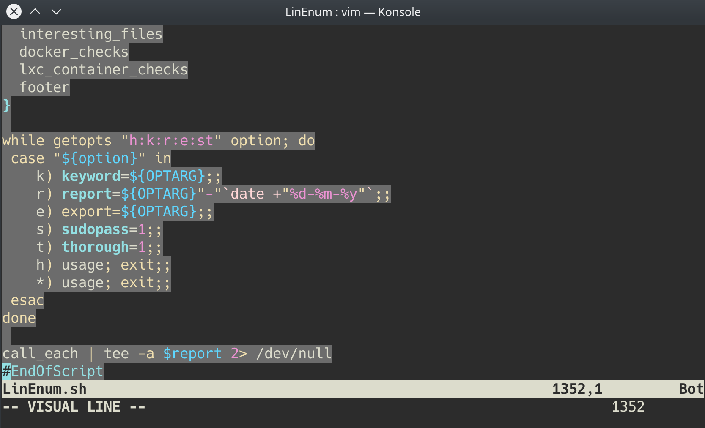
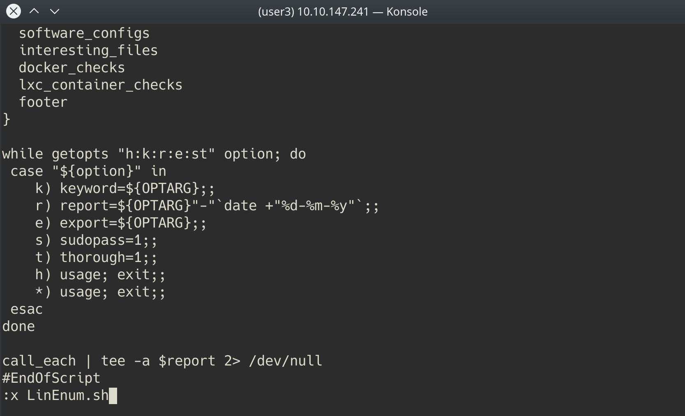

What is LinEnum?

LinEnum is a simple bash script that performs common commands related to privilege escalation, saving time and allowing more effort to be put toward getting root. It is important to understand what commands LinEnum executes, so that you are able to manually enumerate privesc vulnerabilities in a situation where you're unable to use LinEnum or other like scripts. In this room, we will explain what LinEnum is showing, and what commands can be used to replicate it.

Where to get LinEnum

You can download a local copy of LinEnum from:

https://github.com/rebootuser/LinEnum/blob/master/LinEnum.sh

It's worth keeping this somewhere you'll remember, because LinEnum is an invaluable tool.

How do I get LinEnum on the target machine?

There are two ways to get LinEnum on the target machine. The first way, is to go to the directory that you have your local copy of LinEnum stored in, and start a Python web server using "python3 -m http.server 8000" [1]. Then using "wget" on the target machine, and your local IP, you can grab the file from your local machine [2]. Then make the file executable using the command "chmod +x FILENAME.sh".

 [1]

 [2]

Other Methods

In case you're unable to transport the file, you can also, if you have sufficient permissions, copy the raw LinEnum code from your local machine [1] and paste it into a new file on the target, using Vi or Nano [2]. Once you've done this, you can save the file with the ".sh" extension. Then make the file executable using the command "chmod +x FILENAME.sh". You now have now made your own executable copy of the LinEnum script on the target machine!

 [1]

 [2]

Running LinEnum

LinEnum can be run the same way you run any bash script, go to the directory where LinEnum is and run the command "./LinEnum.sh".

Understanding LinEnum Output

The LinEnum output is broken down into different sections, these are the main sections that we will focus on:

Kernel Kernel information is shown here. There is most likely a kernel exploit available for this machine.

Can we read/write sensitive files: The world-writable files are shown below. These are the files that any authenticated user can read and write to. By looking at the permissions of these sensitive files, we can see where there is misconfiguration that allows users who shouldn't usually be able to, to be able to write to sensitive files.

SUID Files: The output for SUID files is shown here. There are a few interesting items that we will definitely look into as a way to escalate privileges. SUID (Set owner User ID up on execution) is a special type of file permissions given to a file. It allows the file to run with permissions of whoever the owner is. If this is root, it runs with root permissions. It can allow us to escalate privileges. 

Crontab Contents: The scheduled cron jobs are shown below. Cron is used to schedule commands at a specific time. These scheduled commands or tasks are known as “cron jobs”. Related to this is the crontab command which creates a crontab file containing commands and instructions for the cron daemon to execute. There is certainly enough information to warrant attempting to exploit Cronjobs here. 